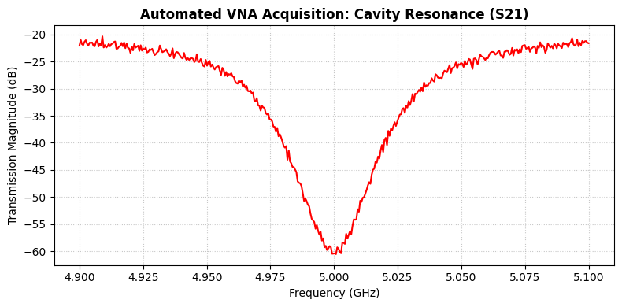

# PyVISA VNA Automation

Python-based automation of a **Vector Network Analyzer (VNA)** using **PyVISA** and **SCPI** commands, featuring an automatic **mock simulation mode** for offline frequency sweep testing and microwave cavity resonance visualization.

---

## Example Output



---

## Overview

This project demonstrates the basic workflow used in modern microwave engineering and experimental quantum science laboratories.

The program attempts to communicate with a **Vector Network Analyzer (VNA)** through **PyVISA**. If no compatible hardware is detected, it automatically switches to a **simulation mode** that generates realistic Lorentzian resonance data for software development and testing.

The acquired (or simulated) data is then plotted and exported as a high-resolution figure.

---

## Features

- Automated VNA communication using PyVISA
- SCPI-based instrument control
- Configurable microwave frequency sweep
- Automatic fallback to simulation mode
- Lorentzian microwave cavity resonance simulation
- Gaussian noise generation for realistic synthetic measurements
- Automated S21 transmission visualization
- High-resolution (300 DPI) figure export

---

## Technologies Used

- Python 3
- NumPy
- Matplotlib
- PyVISA
- SCPI (Standard Commands for Programmable Instruments)

---

## Project Workflow

```
Start Program
      │
      ▼
Initialize PyVISA
      │
      ▼
Attempt VNA Connection
      │
 ┌────┴────┐
 │         │
 │ Success │
 │         │
 ▼         ▼
Real VNA   Simulation Mode
Measurement
 │         │
 └────┬────┘
      ▼
Acquire Frequency Sweep
      ▼
Generate S21 Data
      ▼
Plot Resonance Curve
      ▼
Save High-Resolution Figure
```

---

## Simulated Measurement

When a physical VNA is unavailable, the program generates a synthetic **S21 microwave transmission response** centered near **5 GHz** using a Lorentzian resonance model with additive Gaussian noise.

This enables development and testing without requiring laboratory hardware.

---

## Repository Structure

```
.
├── PyVISA_Mock_VNA_Frequency_Sweep.ipynb
├── vna_acquisition_benchmark.png
└── README.md
```

---

## Installation

Install the required packages:

```bash
pip install numpy matplotlib pyvisa
```

---

## Running the Notebook

Open the notebook in **Google Colab** or **Jupyter Notebook** and execute the cells sequentially.

If a compatible VNA is available through PyVISA, the notebook performs an automated frequency sweep.

Otherwise, it automatically switches to simulation mode.

---

## Learning Objectives

This project demonstrates practical experience with:

- Scientific Python programming
- Laboratory instrument automation
- PyVISA communication
- SCPI command structure
- Microwave frequency sweep automation
- Synthetic experimental data generation
- Scientific data visualization

---

## Future Improvements

- Automatic VISA resource discovery
- Support for multiple SCPI traces
- CSV data export
- HDF5 data export
- Live frequency sweep visualization
- Reflection (S11) measurements
- Multi-port VNA support
- Automatic resonance fitting
- Quality factor (Q-factor) extraction

---

## Disclaimer

Unless a compatible **Vector Network Analyzer** is connected through **PyVISA**, this notebook automatically operates in **simulation mode**.

The generated resonance data is synthetic and intended for software development, learning, and demonstration purposes. It should not be interpreted as experimental data acquired from physical laboratory hardware.

---

## Author

**Aman Kumar**

B.S. in Electronic Systems  
Indian Institute of Technology Madras
